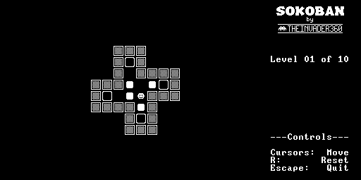

# Sokoban Go

Classic puzzle game written in golang.



## Background

I decided to prototype this application in golang mostly so I could follow a "test driven development" approach, and to a lesser extent so I could get all the benefits of using a modern IDE.

The intention is to port this over to the jack language then run it on the extremely constrained hack platform. It should not in any way be considered an example of how to do things well in golang!

## Usage

```bash
git clone https://github.com/TheInvader360/sokoban-go
```

Then:

```bash
cd sokoban-go
go run main.go
```
